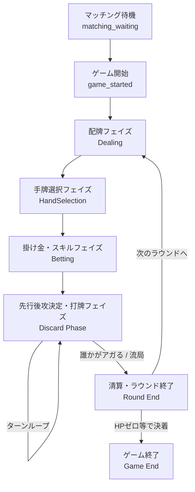

# Killing Mahjong Battle - ゲームフロー仕様書

本ゲームの進行（フェイズ）と、サーバー・クライアント間の主なメッセージのやり取りの流れをまとめました。

## 全体フロー図

---

## 1. マッチング〜ゲーム開始
- **matching_waiting**: プレイヤーが対戦相手を探している状態。
- **game_started**: 対戦相手が見つかり、ゲーム本体が開始された状態。

---

## 2. ラウンド進行（各フェイズの詳細）

ラウンドは複数の「フェイズ」で構成されており、サーバーから `phase_change` メッセージが送られることでフェイズが移行します。

### ① 配牌フェイズ (Dealing)
- 各プレイヤーに牌が配られる（サーバー内部処理）。
- 完了すると `dealing_completed` が通知される。

### ② 手牌選択フェイズ (HandSelection)
- **特殊ルール**: プレイヤーには34枚の壁（Wall）が提示され、その中から **自分の手牌とする13枚** を選びます。
- クライアントからサーバーへ選択を送信すると、条件を満たしていれば `hand_selection_accepted` （受け付け）や `hand_selection_confirmation_required`（役がない場合の確認など）が返ってきます。
- 両者の選択が確定すると `hand_selection_completed` となり、選ばれなかった牌はそのまま「壁（Wall）」として残ります。

### ③ 掛け金・能力フェイズ (Betting)
- 両者がポイントやHP等を賭けたり、スキル（能力）を発動したりするフェイズです。
- スキルを使用すると `skill_casted` が通知され、効果が適用されます。
- お互いの準備が完了すると `bet_completed` となり、いよいよ対局が始まります。

### ④ 打牌フェイズ (Discard)
麻雀のメイン進行部分です。
- サーバーから `discard_phase_started` が送られ、最初のターン（先行）のプレイヤーが通知されます。
- **特殊ルール**: 手牌の13枚は固定されたままで増えません。プレイヤーは **「残っている壁（Wall）」から1枚選んで捨てます**。
- **ターンの流れ**:
  1. 自分のターンで壁の牌を選択し、「捨てる（discard）」アクションをサーバーに送信。
  2. サーバーが受け付けると `discard_accepted` および `discard_completed` が全体に通知され、画面の壁から牌が消えます。
  3. 相手にロン（アガリ）されなければ、相手のターンに移行します（相手が壁から牌を捨てる）。
  4. 相手の `discard_completed` 通知により、再び自分のターンが回ってきます。
- **テンパイ判定**: ターン進行中、テンパイ状態になると `is_tenpai` 通知が届き、待ち牌が設定されます。

---

## 3. アガリと清算

- 誰かが捨てた牌が、もう一人の「待ち牌（wait）」と一致した場合、**ロン（Agari）** が発生します。
- **agari_pending**: アガリが発生した直後に通知され、一時的に自動進行などが停止し、ロンの演出に入ります。
- **round_end**: ラウンドの結果（勝敗、ダメージ計算、スコア等）が計算され、通知されます。ここで結果画面（リザルト）が表示されます。

---

## 4. 次のラウンドへ / ゲーム終了

- 結果確認後、プレイヤーは「次へ」進みます（`next_round_waiting` -> `next_round_accepted`）。
- 勝敗が完全についた（どちらかのHPが0になった等）場合は、**game_end** メッセージが届き、試合終了となります。
